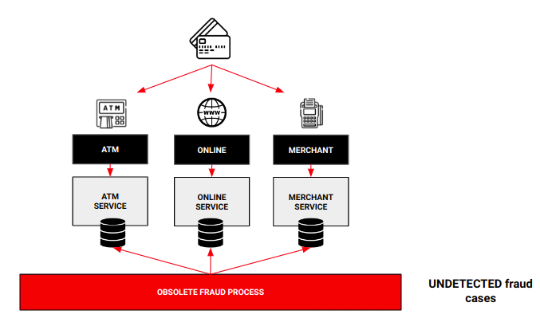

# Fraud Checker Project


This project defines how to detect fraud operations in real time for a banking organization.

For this, it uses **Kafka Streams** but, this time, using a low-level API known as the **processor API** (no DSL). The API has the same role as the Kafka Streams DSL, using an imperative programming style, where the code is generally more verbose since it does not have as many abstractions as the DSL, but it is also more powerful, since it allows fine-grained control of the typologies, of the different processors immersed in the typologies, the states and other operations.

If you want to learn more about Kafka Streams and Processor API, please visit its documentation: https://kafka.apache.org/10/documentation/streams/developer-guide/processor-api.html .

##### Requeriments

- Docker (to build the associated infrastructure)
- JDK 11+


## The problem
A banking organization is having trouble controlling fraud in card transactions. Therefore, this organization needs to detect attempted fraud operations in real time in order to improve security, avoid problems related to this practice and maintain clients confidence.

Currently, exists a large number of movements that the clients are made daily with its cards from several sources, and the processes implemented for the detection of fraud have become obsolete, not being able to react in time to control fraud operations.



How can we solve this problem?


## The solution

In order to create a solution to detect fraud in real time, we must have access to the movements made with the cards in real time.

To do this, the movements must be sent to a Kafka topic at the time the operation is carried out, with the necessary information to be able to study whether there may be fraud or not. The way to send the information to Kafka in time could be done in various ways in this case, implementing a CDC solution, converting the current applications to event-oriented applications, ... (it is not the objective of this project to show a solution for this )


Once the data is accessible, a solution is implemented with Kafka Streams that allows processing all the movements and implementing the different operations to verify the possible fraud in all those movements in real time.

In case movements are detected as fraud, they will be published in another Kafka topic in order to make the pertinent decisions with that revealed data.


It is important to comment that the process is only responsible for reporting possible fraud in real time through rules defined by the organization, which will be responsible for taking the necessary actions with this valuable information.

## The execution

The details to execute the proposed solution to the problem are explained below.

#### Build environment

First, we build the infrastructure that allows us to simulate the defined use case.

- **Zookeeper**
- **Kafka**
- **Kafka UI:** To check data
- **Schema Registry**
- **Ingest process:** Process that simulates the ingestion of movements in Kafka topic

To do this, you have to run the script:

```console
user@machine:~$ sh infrastructure/1-init.sh
```

Once finished, you have everything you need to prove the fraud process.

#### Generate movements

It is necessary to generate mock data to test the solution provided, so the next step will be to launch a process that ingests movements of all kinds in the Kafka queue.

To do this, run the following script

```console
user@machine:~$ sh infrastructure/2-generate-fraud-cases.sh
```

Once finished, different movements will be available in the topic ***movements*** to enrich our fraud process.


#### Run _Fraud Checker_ process

The fraud process will be guided by business rules to detect fraud.

Between them:

- Number of online purchases of the same card in a certain period of time
- Amount of money spent by a card in a certain period of time
- Number of purchases of the same card in different establishments in a period of time

To run the process:

```console
user@machine:~$ mvn package
user@machine:~$  java -jar target/fraud-checker-kstreams-0.0.1-SNAPSHOT.jar
```

Once this is done, the process is running and monitoring all movements to detect possible fraud. In case of fraud, an event with the affected movements will be ingested in the ***fraud-cases*** topic.


#### Analyze the results

Finally, you can check the operation of the process by accessing Kafka UI, verifying the different topics.

```http request
http://localhost:9081/ui/clusters/local/topics/movements
http://localhost:9081/ui/clusters/local/topics/fraud-cases
```

With this, you already have all the tools to play with the process. **Enjoy!**

#### Destroy environment

Finally, to destroy the environment, we simply have to run the following script:

```console
user@machine:~$ sh infrastructure/3-stop.sh
```
